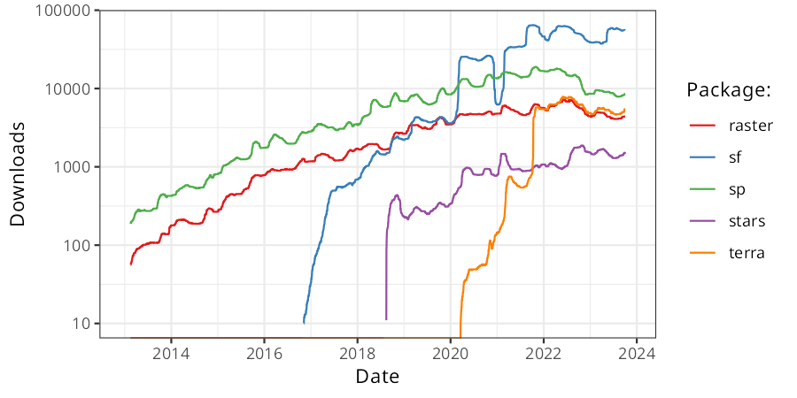

# GEOG 4/5/7 9073: Environmental Analysis in R

## 

## Week 01.02: A quick and limited introduction to R

### Dr. Bitterman

## 

---

# Today's schedule

- Open discussion
- R basics and practice

---

## Anything to discuss? Questions?

---

# A quick bit of background



https://geocompr.robinlovelace.net/intro.html#rs-spatial-ecosystem (for more)

---

# Let's review some GIScience

- Wait, what's GIScience?
- And how's it different than GIS?

---

# A quick review

- Components of a GIS?
- Data types?
- Spatial functions?

---


# Let's get started with some R

1. Open RStudio
2. Create a new project in a temporary working directory (it can be anywhere)
  a. File -> new Project
  b. What do you see?
  c. what's the ```>```?
3. Writing in the console vs. writing code in a script
4. Let's talk about packages... (install **tidyverse**)
5. Assignment: "<-" vs. "="
6. ...and familiarize ourselves with the interface

---

# A quick tour of the R environment

---


# Some simple work

### type the following in the console
```r
x <- 7
```

- the ```<-``` is the "assignment operator"
- ```=``` also works, but can be incorrect in rare occasions
- so use ```<-```

### Did anything else change?

---

# So we have a numeric value stored as a variable

Let's do stuff with it
### Try the following
```r
x + 2
x * 8
x / 1
x ** 2 # what does this do? <- and what is this ancillary text?
x/2 == 0 # what kind of test is this?
```

---

# Working with vectors

A vector is a 1-D ordered collection of values, you designate a vector in R with ```c()```

For example, ```y <- c(1, 2, 3, 4, 5)```

### try it!

### What does your environment viewer tell you?

---

# R operations are "vectorized"

this means you can do things like this:

### STOP: What do you think is going to happen?
```r
y + 2
```

or:

```r
c(1,2,3) + c(4,5,6)
```

---

# But a vector can't mix data types

### What do you think will happen if we try:
```r
z <- c(1, 2, "3")
```

### what DID happen?


---

# Much of R is built on vectors, a lot is also built on lists

### Lists can mix and match data types

```r
mylist <- list(1, 2, "banana")
```
### Vectorized operations don't work on lists...

---

# getting elements from a vector or a list

```r
mylist[2]
```

### what does this return?
### and what does it tell you about R data structures?

---

# data frames

- A 2-dimensional data structure that has a lot in common with a common "table"
- Functionally, it's a list of lists

### Let's break this down first. What do we expect to happen? How does the syntax work?
```r 
mydf <- data.frame(names = c("Huey", "Dewey", "Louis"), 
  height = c(45, 43, 44))

#then... 

mydf
```
### What do you see in the console?

---

# Packages

- Collections of code, function, and data written by others
- The foundation of the R ecosystem
- Need to be "installed" once
- Then need to read into memory for each session
- Packages of packages are a thing

```r
#install it
install.packges("tidyverse") # Quotes here

#load it into memory
library(tidyverse) # no quotes here
```

---

# Calling a function

- once it's in memory, you can call a function directly

```r
filter(mydf, height > 43)
```

- but namespace conflicts happen, so you can be explicit too
```r
dplyr::filter(mydf, height > 43)
```

---

# Getting help on a function

```r
?dplyr::filter
```

### or on a package
```r
?dplyr
```

### Try it, what happens?

---

# Writing your own function

### syntax is a bit weird, so let's break it down
```r
myfirstfunction <- function(x, y){
  x + y
} 
```

### then call the function (make sure it's in memory first)
```r
myfirstfunction(4, 8)
```

---

# If there's time...

- In small groups, figure out how you'd do the following:
- Write a function that takes two integers. If **both are even** or **both are odd**, the function returns **TRUE**. Otherwise, it returns **FALSE**

## 

- Start with the algorithm, NOT the code
- Then try to write the function

---


# Review and next class

- Any questions?

---

# For next class (also on Canvas page)

1. First, download and install the R computing environment (just get the most recent one): https://www.r-project.org 
2. Next, install RStudio Desktop, the IDE we'll use this semester. It's a user-friendly (well, more friendly at least) way to create projects https://www.rstudio.com/products/rstudio/download/ 

---

# More next class (also on Canvas page)

3. If you don't already have a GitHub account, sign up for one. https://github.com 
4. Then, get your GitHub Student Developer Pack. It grants you a LOT of FREE stuff: https://education.github.com/pack/join 
5. We'll talk about git and GitHub in class, but there are many ways to use it. The command line is popular and powerful, but there is a steep learning curve. There are many free and paid software options as well. GitHub Desktop is one of them https://desktop.github.com, but feel free to use your Google-Fu and find something that you like

---

# Homework for next week (also on Canvas page)
1. Complete the above setup steps
2. Review chapters 1 - 4 on the R for Data Science page I linked above. Don't worry, it'll go more quickly than it sounds
3. Come to Tuesday's class with *at least 2* questions you have about R, geospatial programming in general, or this course.

---

- Next week’s readings/tasks: 
  - Chapter 2 in textbook
  - Review Hadley's book/site
  - Practice on your own
- Next week's topics: data structures, data munging, plots 101

