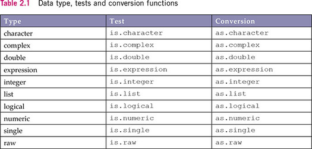

# GEOG 4/5/7 9073: Environmental Analysis in R

## 

## Week 02.01: Data structures and programmatic thinking

### Dr. Bitterman

## 

---

# Today's schedule

- Open discussion
- Data structures
- Exercises

---

## Anything to discuss? Questions?

---

# Your homework for today

(setup your computing environment, review chapters 1-4 in *R for Data Science*, come to class with 2 questions about R, geospatial programming in general, or this course)

### Find a *different* buddy

- Share:
  - How you found the setup process to go (e.g., did you run into any issues?)
  - What you thought of Chapters 1-4
  - Your questions 

### Report out (to the whiteboard!!!)

---

# Bringing everyone along together

- One of our challenges in this kind of course
- Spatial analysis is not programming...
- ...and programming is not spatial analysis

---


# Some handy dandy operations on vectors

### First, create a vector
```r
x <- seq(1:20) # what does this do? How would you know?

# alterative method... seq is an "overloaded" function <- what does this mean?
x <- seq(1, 20, 1) 
```

### Operations

```r
sum(x)
mean(x)
median(x)
sd(x)
length(x)
```

---

# Data types



---

# Factors can be a pain

* What's a "factor" according to your book?
* What are some key properties of factors?
  * Ordering
  * Levels

---

# Interrogating types


### the typeof() function
```r
typeof(8675309)
typeof(integer(8675309))

typeof(TRUE)

typeof("banana")

typeof(rep(1, 10))

typeof(list(1, 3, 4, "orange"))
```

---

# Let's look more closely at data frames and tibbles

### From the course GitHub page, get "oh_counties_DP2020.csv" (it's in the data folder)
(https://github.com/pjbitterman/KSU_spatial_data_sci_R)
```r
library(tidyverse) #get the helper functions

# read the data
mydf <- read_csv("./data/oh_counties_DP2020.csv)

# look at it
mydf
```

### What do you see?

---

# The value of exploratory data analysis (EDA)

- When you first get new data, it's a good idea to look at it before starting work
- Many ways of doing so... like what?

```r
summary(mydf) # what do you get?

# How many observations does your data have?
nrow(mydf)
# and attibutes?
ncol(mydf)

# an easier way to look at attributes
glimpse(mydf)

# access a single attribute
mydf$poptotal # Total population
summary(mydf$poptotal)
hist(mydf$poptotal)

```

---

# Subsetting your data

- Often you need to filter your data such that only those observations meeting certain criteria are retained (or removed)

```r
# requires dplyr/tidyverse
dplyr::filter(mydf, poptotal > 50000 & medianage < 40)
```

### Another way to write that function

```r
mydf %>% dplyr::filter(., poptotal > 50000 & medianage < 40)
```
What's the ```%>%``` and how does it work?

---

# The pipe ```(%>%)```

- from magrittr package
- essentially says "take what's on the left and pass it to the right"
###
- R assumes you want to pipe to the first argument of the right-hand function, but...
- you can explicitly place the output of the pipe using a ```.``` on the right-hand side 

```r
mydf %>% dplyr::filter(., poptotal > 50000 & medianage < 40)
```

### But what's the point? (to the whiteboard!!!)

---

# PLOTTING

---

# Why do we plot our data?

### (I know it's a bit of a silly question, just go with it)

---

# Many methods, we'll focus on two (but really just one)

1. "base R"
2. ggplot

---

# Setup

- Open RStudio, start a new project (or use the one from last class)
- Make sure you have ```oh_counties_DP2020.csv``` from last class

### Required packages
```r
library(tidyverse)
library(ggplot2)
```
### read the data, remind yourself what it looks like
```r
mydf <- read_csv("./data/oh_counties_DP2020.csv")
glimpse(mydf)
```
---

# Some simple base R plots

### the "plot" function can be used in multiple ways
```r
# scatter plot
# should be highly correlated
plot(mydf$poptotal, mydf$Hhtotal)
```
### What do you see?

```r
# scatter plot #2
plot(mydf$medianage, mydf$Hhtotal)
```

---

# Let's try a histogram

```r
# histogram
hist(mydf$Hhtotal)
```

### and exert a bit more control
```r
# change the number of breaks
hist(mydf$Hhtotal, breaks = 20)
```

---

# ggplot : "the grammar of graphics"
### Let's build a plot step-by-step

---

# the setup

### 
```r
# the initial call
ggplot(mydf, aes(x = poptotal, y = medianage))
```
### What happened?

---

# Let's add a geom

### Wait, what's a "geom"???

```r
ggplot(mydf, aes(x = poptotal, y = medianage)) +
  geom_point()
```
### Note the "+" ...it's a very different notation

### and we can modify the points:
```r
ggplot(mydf, aes(x = poptotal, y = medianage)) +
  geom_point(colour = "blue")
```

---

# And alter the theme

```r
ggplot(mydf, aes(x = poptotal, y = medianage)) +
  geom_point(colour = "blue") +
  theme_minimal()
```
### Try a different one! How would you know what options there are for themes?

---

# Add some labels

```r
ggplot(mydf, aes(x = poptotal, y = medianage)) +
  geom_point(colour = "blue") +
  theme_minimal() +
  labs(x = "Total Population", y = "Median Age")
```

---

# ...and add a title

```r
# and give it a title
ggplot(mydf, aes(x = poptotal, y = medianage)) +
  geom_point(colour = "blue") +
  theme_minimal() +
  labs(x = "Total Population", y = "Median Age", 
  title = "My First ggplot")
```

---
# fit a line

### don't just throw arbitrary models/fits on your data
```r
ggplot(mydf, aes(x = poptotal, y = medianage)) +
  geom_point(colour = "blue") +
  geom_smooth(method = "glm", colour = "red") +
  theme_minimal() +
  labs(x = "Total Population", y = "Median Age", 
  title = "My First ggplot")
```

---

# Let's try something different

---

# Using categorical data
### (first, we have to make some categories) - let's walk through this code

```r
mydf2 <- mydf %>% mutate(sizeCategory = ifelse(poptotal > 100000, "big", "small"))
```

### check your work:
```r
summary(mydf2$sizeCategory) ### What happened?

# turn them into factors to count them
summary(as.factor(mydf2$sizeCategory))
```

---

# A first example

### Let's break it down:
```r
ggplot(mydf2, aes(x = poptotal, y = medianage)) +
  geom_point(aes(shape = sizeCategory, colour = sizeCategory), size = 3) +
  theme_minimal() +
  labs(x = "Total Population", y = "Median Age",
       title = "My formatted ggplot")
```
### what happened?

---

# One more example:

# a pipe with a boxplot
```r
mydf2 %>% ggplot(., aes(x = sizeCategory, y = medianage)) +
  geom_boxplot(aes(fill = sizeCategory)) +
  theme_minimal() + 
  labs(x = "Categorical size",
       y = "Median Age", 
       title = "I made a boxplot",
       subtitle = "...it's handy for comparing groups")
```

---

# If there's time, try it yourself:

### using ggplot:
- Make a histogram
- Try a barplot...
  - subset of the counties (however you want)
  - counties on the x-axis, number of vacant units on the y-axis

---


# Review and next class

- Any questions?

- This week’s readings/tasks: 
  - Chapter 2 in textbook
  - Continue to review Hadley's book/site
  - Practice on your own


