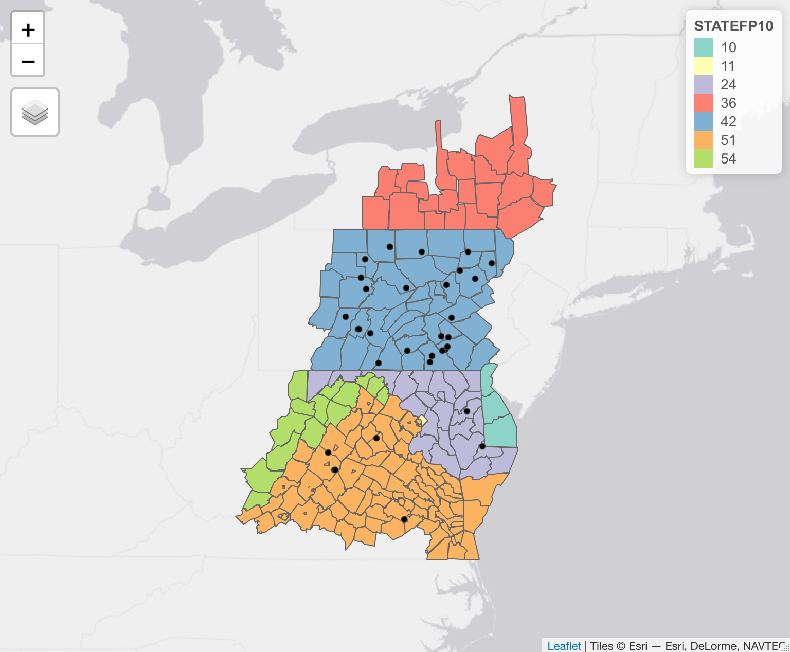

# GEOG 4/5/7 9073: Environmental Analysis in R

## 

## Week 7.01: More spatial data operations

### Dr. Bitterman

## 

---

# Today's schedule

- Open discussion
- Schedule "stuff"
- Topology and the "9-intersection model"
- Spatial data operations
- Activity

---

## Anything to discuss? Questions?

---

# Updates and minor changes

- This week will cover "weeks 7 & 8" on Canvas
- Next week is Spring Break
- I have moved lab 3 to AFTER BREAK, pushed due date into April
- We're back for 1 week after break (Localized spatial anlaysis)...
- Then "off" again for AAG (big geography conference)


---


# today's setup

```r
library(tidyverse)
library(GISTools)
library(sf)
library(tmap)
```

---

# What does "topology" mean?

### ...and "ontology"?

### and why should we care?

---


# The "9-intersection model"


---

# Spatial predicates

- Equals
- Disjoint
- Touches (meets)
- Contains
- Covers
- Intersects
- Within (inside)
- Covered by
- Crosses
- Overlaps

---

# Spatial predicates in ```sf::```

- Equals ```st_equals```
- Disjoint ```st_disjoint```
- Touches (meets) ```st_touches```
- Contains ```st_contains```
- Covers ```st_covers```
- Intersects ```st_intersects```
- Within (inside) ```st_within```
- Covered by ```st_covered_by```
- Crosses ```st_crosses```
- Overlaps ```st_overlaps```

---

# Let's try some of them

---

# Today's data

```r
counties <- sf::read_sf("./data/CBW/County_Boundaries.shp") %>% sf::st_make_valid()

dams <- sf::read_sf("./data/CBW/Dam_or_Other_Blockage_Removed_2012_2017.shp") %>% sf::st_make_valid()

streams <- sf::read_sf("./data/CBW/Streams_Opened_by_Dam_Removal_2012_2017.shp") %>% sf::st_make_valid()
```

---


(no streams mapped)

---

# Remind me, how would we find the dams that are in Pennsylvania?

---

# First, let's get the counties in PA

```r
pa.counties <- counties %>% filter(STATEFP10 == 42)
```

---

# Dams in PA

### Multiple methods
```r
pa.dams <- st_intersection(dams, pa.counties)

# or

pa.dams <- dams[pa.counties,]
```

### How do these functions work? (and what do they output?)

---

# Let's use a predicate to see the Boolean result

```r
st_intersects(dams, pa.counties)
```
### What's the output?

---

# Order matters

```r
# order matters
dams %>% st_intersects(x = ., y = pa.counties)
dams %>% st_intersects(x = pa.counties, y = .)
```
---

# Matrix output with the ```sparse``` parameter

### Try this
```r
# get a dense logical matrix
dams %>% st_intersects(x = ., y = pa.counties, sparse = F)
```
### How should we interpret the output?

---

# Other predicates

```r
# Disjoint
dams %>% st_disjoint(., pa.counties, sparse = F)

# Within
dams %>% st_within(., pa.counties, sparse = F)
```
---

# More examples

```r
c.tioga <- counties %>% 
  dplyr::filter(str_detect(NAME10, "Tioga") & STATEFP10 == 42)

streams.tioga <- streams %>% st_intersection(., c.tioga)

# double check the work
streams.tioga %>% st_covered_by(., c.tioga)
tm_shape(c.tioga) + tm_polygons(fill = "tan") + tm_shape(streams.tioga) + tm_lines(col = "blue")
```
### distance
```r
streams.tioga %>% st_is_within_distance(., dams, 1)
```
---

# Spatial joins

### How do *tabular* joins work?

### Spatial joins are similar, but use spatial relationships

---

# How we normally think about spatial joins...

*if A intersects B, then take the attributes from B, and join them to A*
(and discard all elements from B where "intersects" is false)

- This is how ArcGIS Pro works
- But we don't need to restrict ourselves to the "intersects" predicate


---

# calling ```sf::st_join```

### From the help menu...
```r
st_join(
  x,
  y,
  join = st_intersects,
  ...,
  suffix = c(".x", ".y"),
  left = TRUE,
  largest = FALSE
)
```

---

# A sptial join the "typical" way

```r
st_join(pa.counties, dams, join = st_intersects)
```

---

# But we can perform spatial joins using other predicates...

```r
st_join(pa.counties, dams, join = st_disjoint)
```

### or...
```r
st_join(pa.counties, streams, join = st_touches)
```
---

# Think back to the 9-intersection model...
# and explore (try) some more yourself!

---

# Part 2

---

# A story from my Vermont research

- Nutrient runoff (primarily phosphorus) causes harmful cyanobacteria blooms in Lake Champlain
- TMDL regulations "limit" the amount of criteria pollutants allowed to enter water bodies that flow to the Lake
- To regulate, and to improve, we need to measure
- So EPA has broken-down the Lake Champlain Basin into units of analysis called **NHDPlus segments**

---

# But management is a different issue

- We don't commonly manage water-related problems using watershed-derived jurisdictions
- We should, but we don't
- In Vermont, they'd doing something a bit different
- Tactical Basins, CWSPs, and RPCs


---


# Let's estimate the load in each RPC

---

# Start with the NHDs

```r
# NHDs
nhds <- sf::read_sf("./data/nhdplus_loads.shp") %>% sf::st_make_valid()
glimpse(nhds)
tm_shape(nhds) + tm_polygons(fill = "Baseline_L", n = 10)
```
### ```Baseline_L``` is phosphorus load in kg/year

---


# And now the RPCs

```r
# RPCs
rpcs <- sf::read_sf("./data/gn_vt_rpcs.shp") %>% sf::st_make_valid()
glimpse(rpcs) 
tm_shape(rpcs) + tm_polygons(fill = "INITIALS")
```
---


# Overlay them

```r
tm_shape(rpcs) + tm_borders(col = "red") +
  tm_shape(nhds) + tm_polygons(fill = "Baseline_L", n = 7) +
  tm_shape(rpcs) + tm_borders(col = "red")
```
### Why am I calling `tm_shape(rpcs)` twice? Any ideas?

---
# Our objective:

### Calculate the total phosphorus load in each RPC

### Ideas for how to accomplish that task?

---

# A spatial join

```r
# do the join
nhd_rpcs <- st_join(nhds, rpcs, join = st_intersects)

# look at it/confirm it worked
glimpse(nhd_rpcs)

# plot it
tm_shape(nhd_rpcs) + tm_polygons(fill = "RPC")
```

---
# and now to summarize...

### Suggestions?

---
# The "tidy way"

```r
# the "tidy way"
nhd_rpcs %>% 
  group_by(RPC) %>% 
  summarize(totalLoad = sum(Baseline_L))
```
### What was the output?

---

# Add a line to plot it

```r
nhd_rpcs %>% 
  group_by(RPC) %>% 
  summarize(totalLoad = sum(Baseline_L)) %>%
  tm_shape(.) + tm_polygons(fill = "totalLoad") # <- this line is new
```
### the utility of pipes

---

# An alternative method

### from your book...

- works a bit differently
- uses ```sf``` features to do the aggregation
```r
# using aggregate instead
aggregate(x = nhds, by = rpcs, FUN = sum) # throws an error... what's the problem?
```

### Error message:

```r
Error in FUN(X[[i]], ...) : invalid 'type' (character) of argument
```
### What's the problem?

---

# Fixing the problem

```r
glimpse(nhds) # How many character attributes?

# fix the problem
nhds %>% dplyr::select(-SOURCEFC, -NHDPlus_Ca, -Tactical_B) %>%
  aggregate(x = ., by = rpcs, FUN = sum)
```

---

# Do it again, but assign it to a variable

```r
# same function, but assign it to a variable
agg.rpcs <- nhds %>% dplyr::select(-SOURCEFC, -NHDPlus_Ca, -Tactical_B) %>%
  aggregate(x = ., by = rpcs, FUN = sum)
```

### Plot it
```r
# plot it... why and how is it different?
tm_shape(agg.rpcs) + tm_polygons(fill = "Baseline_L")
```
**how/why is it different than our earlier plot?**

---

# So, have we completed our task?

### Any remaining issues?

---

# Let's check our spatial relationships

### Break down the code
```r
# issues with overlap
nhd_rpcs %>% group_by(NHDPlus_ID) %>% summarise(count = n()) %>%
  arrange(desc(count))
```

### What's the result?

---

# Check with a quick plot
```r

# same as above, but plot it
nhd_rpcs %>% group_by(NHDPlus_ID) %>% summarise(count = n()) %>%
  arrange(desc(count)) %>%
  mutate(count = as.character(count)) %>% # this is a shortcut, 
  # and while it works, not best practice
  tm_shape(.) + tm_polygons(fill = "count")

```
---

# Area-weighted interpolation
**(to the whiteboard!)**

```r
# area-weighted interpolation
interp.loads <- nhds %>% dplyr::select(Baseline_L, geometry) %>% 
  st_interpolate_aw(., rpcs, extensive = T)

tm_shape(interp.loads) + tm_polygons(fill = "Baseline_L")
```

### Same? Different? How can we compare?

---

# Do a join
**(note, I'm cheating a bit here and relying on the RPC geometry being identical)**

```r
# do a join 
comparison <- st_join(agg.rpcs, interp.loads, st_equals)

# calculate the error, then map it
tmap_mode("view")

comparison %>% mutate(diff = Baseline_L.x - Baseline_L.y) %>%
  tm_shape(.) + tm_polygons(col = "diff") +
  tm_shape(nhds) + tm_borders(col = "blue")
```
### How different were the methods?

---

# If there's time, return to the code reading activity...

---

## For this week

- Thursday will be a "wild card" day, and WILL REQUIRE YOU TO HAVE READ CHAPTER 5
- Chapter 5 from Lovelace (https://geocompr.robinlovelace.net/geometric-operations.html)
- Practice, practice, practice
- Work on your projects (in-class updates after spring break)

