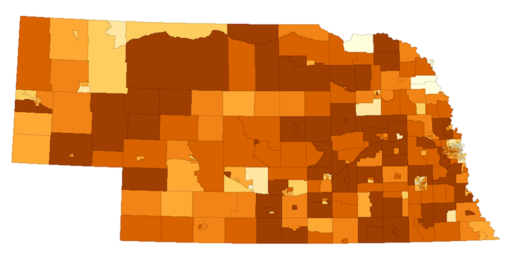
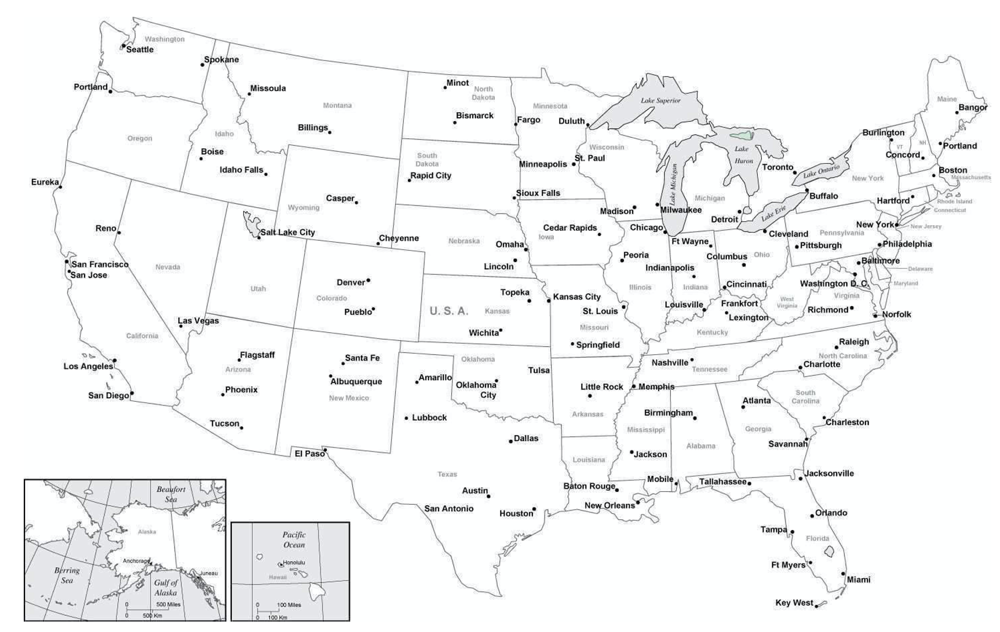
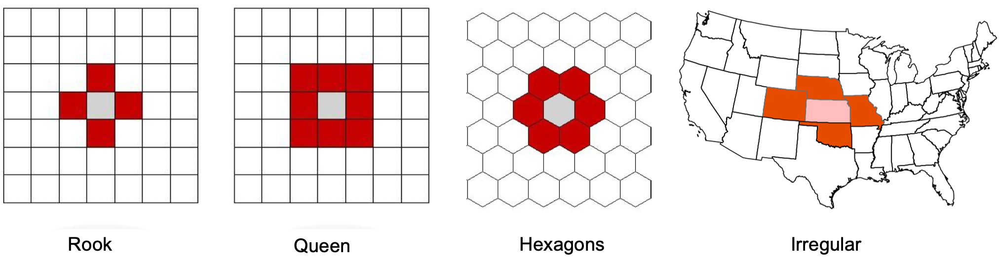
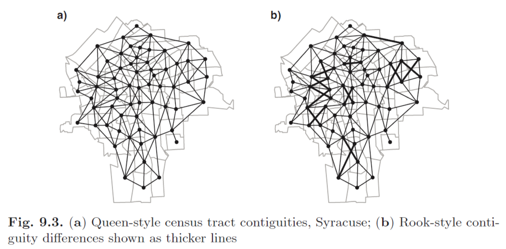
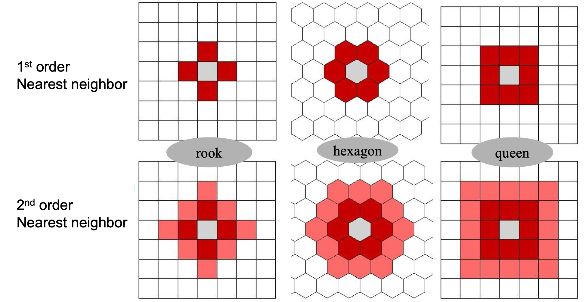
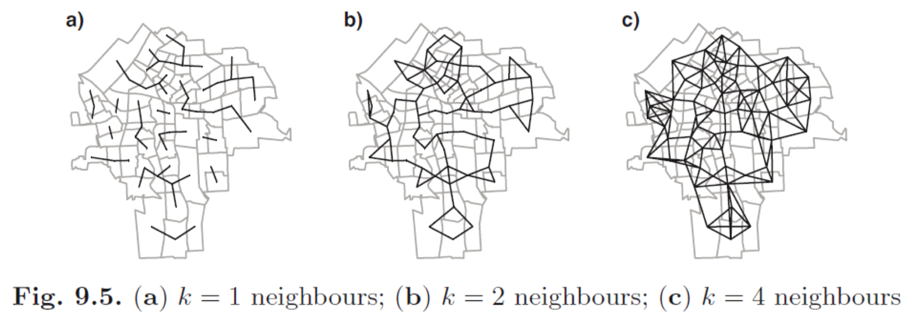
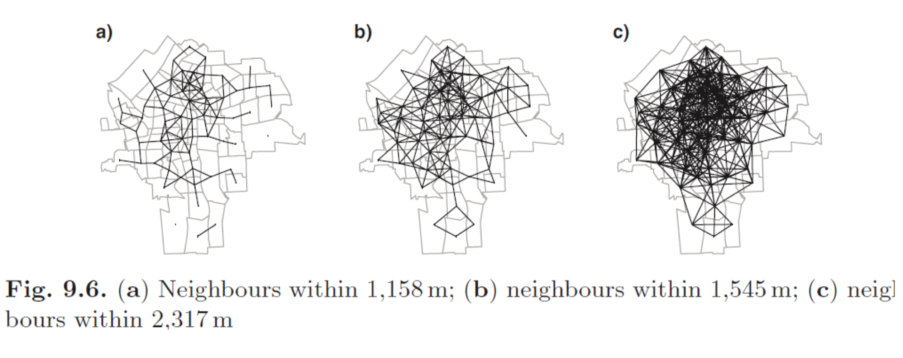
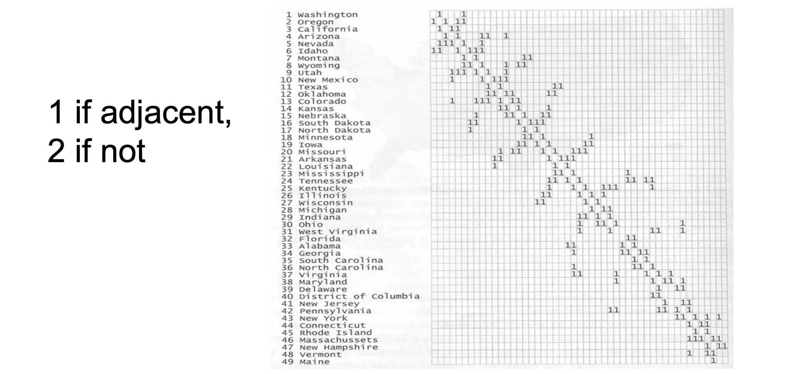
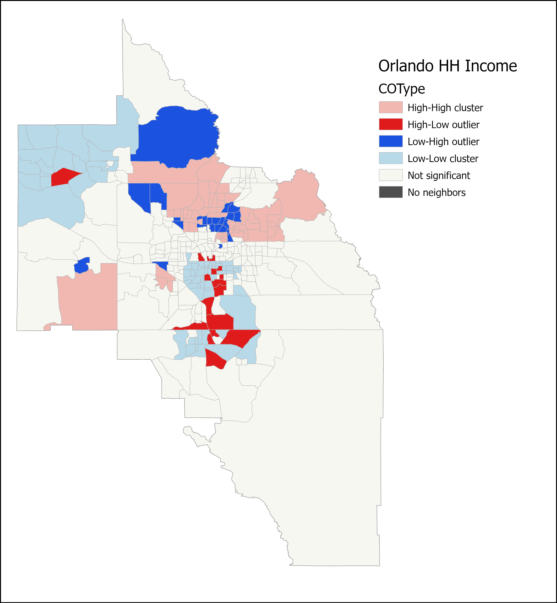
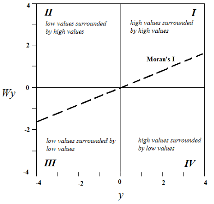

# GEOG 4/5/7 9073: Environmental Analysis in R

## 

## Week 9.01: Localized spatial analysis

### Dr. Bitterman

## 

---

# Today's schedule

- Open discussion
- Autocorrelation and its metrics (lecture)

---

## Anything to discuss? Questions?


---

# Remaining topics

- Week 10: Localized Spatial Analysis (Intro lab 3), update presentations
- Week 11: AAG
- Week 12: Rasters
- Week 13: Making maps (Intro lab 4)
- Week 14: Interactive mapping (Intro lab 5)
- Week 15: Applications
- Week 16: Project presentations

---


# This week's plan

- Today: lecture on formalizing space (it may look familiar to some of you)
- Thursday: 
    - update presentations
    - lab that builds on lecture and demonstrates how to calculate spatial autocorrelation in R

---


# Today is about formalization

* Why?
* But also, WHY???
* Formalizing spatial relationships is foundational
    * "Global" spatial autocorrelation
    * Local spatial autocorrelation metrics
    * Spatial clustering
    * Hot spots/cold spots

---

# Tobler's first law of Geography

* Everything is related to everything else, but nearer things are more related than farther (or something like that)

* Formally, *spatial autocorrelation*

---

## Spatial autocorrelation of areal units (% white, 2010 Census)



---

# Relevant questions

- Which areas are important?
- Which areas are unusual?
- Are there “hotspots” of some phenomena?
- How much influence do neighbors have?
- How should we measure/ conceptualize “neighbors”?
- Implications of our choices?


---
# Spatial autocorrelation

*the degree to which a variable is correlated with itself across space. It indicates whether similar values cluster together or are dispersed in a given spatial distribution*

### Types of Spatial Autocorrelation:

- Positive Spatial Autocorrelation: Nearby locations have similar values (e.g., high-income neighborhoods clustering together)
- Negative Spatial Autocorrelation: Nearby locations have dissimilar values (e.g., urban-rural income disparities)
- Zero Spatial Autocorrelation: No spatial pattern, values are randomly distributed

---

# Spatial autocorrelation foundations

### Tobler’s First Law of Geography: "Everything is related to everything else, but near things are more related than distant things."

* Positive Spatial Autocorrelation: Nearby locations have similar values
    * Example: Cyanobacteria blooms tend to cluster in specific parts of Lake Erie
* Negative Spatial Autocorrelation: Nearby locations have opposite values
    * Example: Temperature inversion effects—low temperatures in valleys, high temperatures on ridges


---


---

# Why does SA matter?

1. Helps identify spatial patterns (e.g., clustering of environmental pollutants)
2. Impacts statistical modeling (e.g., regression models that assume independence may be invalid)
3. Affects interpolation methods used for predicting missing data.

---

# A digression into formalization of neighborhoods

---


# Spatial context matters

- For a statistical method to be explicitly spatial, it needs to contain some representation of the geography, or spatial context

- One of the most common ways is through *spatial weights matrices*

---

# Formalizing processes

- **(Geo)Visualization**: translating numbers into a (visual) language that the human brain “speaks better”

- **Spatial Weights Matrices**: translating geography into a (numerical) language that a computer “speaks better”

---

# Spatial weights matrices

Core element in several spatial analysis techniques:

- Spatial autocorrelation
- Spatial clustering / geodemographics 
- Spatial regression

---

# Formalization

*W* as a formal representation of space

---

# *W* (the spatial weights matrix)

- *N x N positive matrix* that contains **spatial relations** between all the observations in the sample 

- FORMALLY, w<sub>ij</sub>... the weight from zone *i* to zone *j*

- Core concept in statistical analysis of areal data

- Two steps involved:
    - define which relationships between observations are to be given a nonzero weight, i.e., define spatial neighbors
    - assign weights to the neighbors

*w<sub>ii</sub>* = 0 (by convention)

### *...what is a neighbor?*

---

# How would you define a "neighbor"?

- Making the neighbors and weights is not easy as it seems to be

- Which states are near Ohio?

---



--- 

# What IS a neighbor?

A neighbor is “somebody” who is:
- Next door → **Contiguity**-based Ws
- Close → **Distance**-based Ws


---

# Spatial neighbors

### Contiguity-based neighbors

- Zone i and j are neighbors if zone i is contiguous or adjacent to zone j
- But what constitutes contiguity?

### Distance-based neighbors

- Zone i and j are neighbors if the distance between them are less than the threshold distance
- But what distance do we use?

---

# Choice of W

- Should be based on and reflect the underlying channels of interaction for the question at hand. Examples:
    - Processes propagated by immediate contact (e.g. disease contagion) → Contiguity weights 
    - Accessibility → Distance weights
    - Effects of county differences in laws → Block weights

---

# Contiguity

- Common boundaries: if two polygons share boundaries to some degree, they will be labeled as neighbors under these kinds of weights
    - **Queen**: only need to share a vertex (a common POINT)
    - **Rook**: share a vertex AND a line segment
- Depending on the level of irregularity, queen and rooks contiguity may be *very* similar (if not identical)


---

# Contiguity-based Spatial Neighbors



---

# Example



---

# Higher-order contiguity



---

# Distance-based neighbors

- How do we measure distance between polygons?
- Distance metrics
    - 2D Cartesian distance (projected data)
    - 3D spherical distance/great-circle distance (lat/long data)

- *But where do we measure from?*
- *Any implications of our choices?*

---

# Distance-based neighbors (k-nearest)



---

# Distance-based neighbors (threshold distance)




---

# A simple spatial weights matrix



---

# Decay functions of distance

- Most common choice is the multiplicative inverse (reciprocal) of the distance between locations *i* and *j*
- Other functions also used
    - inverse of squared distance 
    - Or negative exponential 


---


# Standardization

- In some applications (e.g. spatial autocorrelation) it is common to standardize W
- The most widely used standardization is row-based: divide every element by the sum of the row


---

# Back to spatial autocorrelation...

---


# Measuring SA


**Moran’s I** – A ***global*** measure indicating overall spatial autocorrelation in a dataset. Values range from -1 (negative) to +1 (positive), with 0 indicating no spatial pattern

###

$$
I = \frac{N}{\sum_{i} \sum_{j} w_{ij}} \times \frac{\sum_{i} \sum_{j} w_{ij} (x_i - \bar{x}) (x_j - \bar{x})}{\sum_{i} (x_i - \bar{x})^2}
$$

### What Each Part Means

- **$N$** = Total number of locations (e.g., cities, counties, pixels)  
- **$x_i$** = Value of the variable at location $i$ (e.g., population density, crime rate)  
- **$\bar{x}$** = Mean (average) of the variable across all locations  
- **$w_{ij}$** = Spatial weight between location $i$ and location $j$ (defines how "close" or "connected" two locations are)  

---
# Breaking It Into Two Main Parts

$$
I = \frac{N}{\sum_{i} \sum_{j} w_{ij}} \times \frac{\sum_{i} \sum_{j} w_{ij} (x_i - \bar{x}) (x_j - \bar{x})}{\sum_{i} (x_i - \bar{x})^2}
$$

- The numerator
    - Measures whether locations with similar values are near each other
    - If nearby locations have similar values, the sum will be high → positive spatial autocorrelation
     - If nearby locations have very different values, the sum will be negative → negative spatial autocorrelation
- The denominator
    - This is just a standard variance measure, which helps us scale the statistic so it is comparable across datasets

---

# Testing for spatial autocorrelation in R isn't too hard

```r
moran.test(sf_object$variable, weights_file)
```

##

##

## In practice (see lab 3)

```r
moran.test(ohio.projected$B01001e47, lw)
```


---


# Transitioning to Local Measures of Spatial Autocorrelation

---

### We’ve explored Moran’s I as a global measure of spatial autocorrelation…
- It tells us whether spatial autocorrelation exists across the entire study area...
- but what if patterns vary within the study region?

### A single global statistic may miss localized clusters and variations

##

## *To better understand spatial heterogeneity, we need local measures*

---

# Local Indicators of Spatial Association (LISAs)

### LISAs help answer key questions:
1. Where are significant clusters of high or low values?
2. Are there spatial outliers—areas with values different from their neighbors?
3. How does spatial autocorrelation vary across a region?

##

### LISAs allow us to detect and map local patterns that global measures might overlook


---

# Spatial lag (can be confusing)

### *Formally...*

The product of a spatial weights matrix *W* and a given variable *y*

Wy<sub>i</sub> = $\sum$ w<sub>ij</sub>y<sub>ij</sub>

---

# more generally:

- Measure that captures the behavior of a variable in the neighborhood of a given observation *i*

- If *W* is standardized, the spatial lag is the average value of the variable in the neighborhood of *i*

- Common notation: the spatial lag of *y* is expressed as *W<sub>y</sub>*

- With a neighbor structure defined by the non-zero elements of the spatial weights matrix W, a spatially lagged variable is a weighted sum or a weighted average of the neighboring values for that variable


---

# Back to the formalization

The product of a spatial weights matrix *W* and a given variable *y*

Wy<sub>i</sub> = $\sum$ w<sub>ij</sub>y<sub>ij</sub>


---

# Moran plot

A standardized Moran Plot also partitions the space into four quadrants that represent different situations:

1. High-High (HH): high values above average surrounded by values above average

2. Low-Low (LL): low values below average surrounded by values below average

3. High-Low (HL): high values above average surrounded by values below average

4. Low-High (LH): low values below average surrounded by values above average

---



## Clusters and outliers

- **"Clusters":** high values surrounded by high (H-H) OR low surrounded by low (L-L)
- **"Outliers":** low surrounded by high (L-H) OR high surrounded by low (H-L)

### *Requires Monte Carlo test of statistical significance*

---


# More about Moran statistics

- A standardized Moran Plot implies that average values are centered in the plot (as they are zero when standardized) and dispersion is expressed in standard deviations

- General rule: values greater or smaller than two standard deviations are considered *outliers*

---




---

## For this week

- Thursday:
    - Lab 3
    - In-class presentations
- Chapter 8 from your textbook
- Practice, practice, practice


