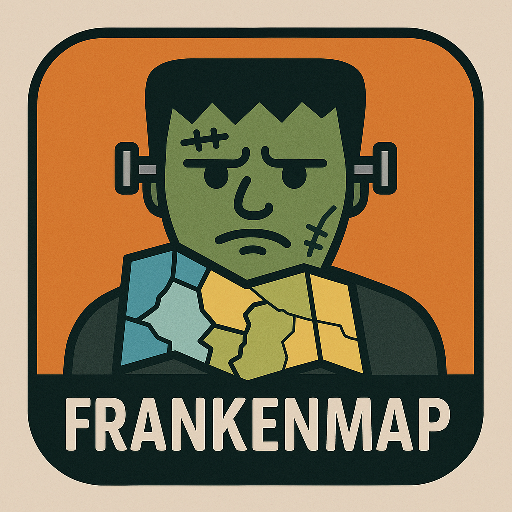

# This week is semi-experimental

- Readings/demos: Lovelace, Ch 8 (https://geocompr.robinlovelace.net/adv-map.html#static-maps)
- Walks through:
  - Fills/shades
  - Borders
  - Multiple layers
  - Color settings
  - Layouts
  - Facets
  - Insets


Load relevant packages

```{r}
library(sf)
library(terra)
library(tmap)
library(spData) # new package - you'll likely need to install
library(tidyverse)
```

Let's talk about non-CRAN packages
```{r}
# next line is commented out becasue you only need to install once
#install.packages("spDataLarge", repos = "https://nowosad.github.io/drat/", type = "source")

library(spDataLarge)

```

We'll use this later

```{r}
nz_elev = rast(system.file("raster/nz_elev.tif", package = "spDataLarge"))
```


`tmap` uses a similar "grammar of graphics" as `ggplot2`

simple fill

```{r}

tm_shape(nz) +
  tm_fill() 

```

or...

```{r}
tm_shape(nz) +
  tm_borders()
```

Or layer two different symbologies

```{r}
tm_shape(nz) +
  tm_fill() +
  tm_borders()
```


But keep in mind - ORDER MATTERS!!!

```{r}

tm_shape(nz) +
  tm_borders() +
    tm_fill()

```

Add layers and assign your map to a variable

```{r}
map_nz_base = tm_shape(nz) + tm_polygons()

map_nz_blue_dots = map_nz_base +
  tm_shape(nz_height) + tm_dots(size = 0.25, fill = "blue")
```

What happened? Nothing

You can simply call the variable to plot it

```{r}
map_nz_blue_dots

```

It can be useful to "reuse" the base of a map and add different layers. 

WAIT - Let's first break down this code

```{r}
map_nz_red_bubbles = map_nz_base +
  tm_shape(nz_height) + tm_bubbles(size = "elevation", 
                                   fill = "darkred", 
                                   lwd = 0, 
                                   fill_alpha = .4)


map_nz_red_bubbles

```

Things to note:
1. dots vs. bubbles
2. fill vs. col (read the documentation)
3. variables used to change symbology are inside "": ```size = elevation```


# The utility of this sort of grammar

```
map <- base + layer_1 + layer_2 + aesthetic + function + layer_3
```

## We're going to leverage this flexibility to break down a mapping task into constituent parts

# More examples

```{r}
tm_shape(nz) + tm_polygons(fill = "Median_income")
```

Let's create a new object that represents NZ's territorial waters. Who want to help break down the code?

```{r}
nz_water = st_union(nz) %>%
     st_buffer(22200) %>%
     st_cast(to = "LINESTRING")
```

How would we know what units the `22200` is in the buffer function?

Plot it to show our work

```{r}
tm_shape(nz_water) + tm_lines()
```

# Let's build a map in pieces

First, the base map and elevation

```{r}

map1 <- tm_shape(nz) + tm_polygons() +
  tm_shape(nz_elev) + tm_raster(col_alpha = 0.7)

map1

```

Next, let's setup the water boundaries

```{r}
map2 <- tm_shape(nz_water) + tm_lines()

map2
```

Finally, we can symbolize the heighest points

```{r}
map3 <- tm_shape(nz_height) + tm_symbols()

map3
```

And then put it all together...

```{r}
map.all <- map1 + map2 + map3

map.all
```

From your readings:
How to arrange multiple maps into a single plot

```{r}
map.arr <- tmap_arrange(map1, map2, map3)

map.arr

```

Any issues here?

## TONS more options

Let's go through one-by-one

```{r}
ma1 = tm_shape(nz) + tm_polygons(fill = "red")
ma2 = tm_shape(nz) + tm_polygons(fill = "red", fill_alpha = 0.3)
ma3 = tm_shape(nz) + tm_polygons(col = "blue")
ma4 = tm_shape(nz) + tm_polygons(lwd = 3)
ma5 = tm_shape(nz) + tm_polygons(lty = 2)
ma6 = tm_shape(nz) + tm_polygons(fill = "red", fill_alpha = 0.3,
                                 col = "blue", lwd = 3, lty = 2)
tmap_arrange(ma1, ma2, ma3, ma4, ma5, ma6)
```

## Choropleth mapping options

Setting your own breaks

```{r}
tm_shape(nz) + tm_polygons(fill = "Median_income")
tm_shape(nz) + tm_polygons(fill = "Median_income",
                        fill.scale = tm_scale(breaks = c(0, 30000, 40000, 50000)))

```

A different way: 10 breaks

```{r}
tm_shape(nz) + tm_polygons(fill = "Median_income",
                           fill.scale = tm_scale(n = 10))

```

# Tmap default with shading

```{r}
tm_shape(nz) + tm_polygons(fill = "Median_income",
                           fill.scale = tm_scale(values = "BuGn"))
```

# Standard methods

Let's go one by one

## Equal interval

```{r}
tm_shape(nz) + tm_polygons(fill = "Median_income",
                           fill.scale = tm_scale_intervals(style = "equal", values = "BuGn"))
```

## Jenks

```{r}
tm_shape(nz) + tm_polygons(fill = "Median_income",
                           fill.scale = tm_scale_intervals(style = "jenks", values = "viridis"))
```

## Quantiles

```{r}
tm_shape(nz) + tm_polygons(fill = "Median_income",
                           fill.scale = tm_scale_intervals(style = "quantile", values = "brewer.purples", n = 5))
```

# Legends

Let's start simple: changing the title

```{r}
legend_title = expression("Area (km"^2*")")
tm_shape(nz) +
  tm_polygons(fill = "Land_area", fill.legend = tm_legend(title = legend_title))
```

A bit more complicated: title, orientation, and position

```{r}
tm_shape(nz) +
  tm_polygons(fill = "Land_area",
              fill.legend = tm_legend(title = legend_title,
                                      orientation = "landscape",
                                      position = tm_pos_out("center", "bottom")))
```

We can of course pick and choose: let's keep the legend in "portrait mode"

```{r}
tm_shape(nz) +
  tm_polygons(fill = "Land_area",
              fill.legend = tm_legend(title = legend_title,
                                      position = tm_pos_out("center", "bottom")))
```

Lastly, we can use tmap modes to be more interactive if we want

```{r}
tmap_mode(mode = "view")

tm_shape(nz) +
  tm_polygons(fill = "Land_area",
              fill.legend = tm_legend(title = legend_title,
                                      position = tm_pos_out("center", "bottom")))

ttm()

```

Try clicking on a feature - what happens?

There is a LOT more detail in your readings for today, which we're going to leverage in your next activity:


# Activity: Building a frankenmap




1. I will break the class into three groups
2. As separate groups, you'll accomplish series of cartographic tasks
3. Then we'll bring them together at the end and code up a single visualization

## Data:
- in our GitHub repo
- `./data/static_mapping/`
- you WILL need to use these data to derive some other products (e.g., smaller rasters, joined census data)

## GROUP 1 - Ohio scale

1. Ohio counties, symbolized (filled) by some variable of interest. You will need to use a tabular join (`left_join()`, most likely) between spatial and tabular data
2. Borders symbolized using NON-DEFAULT symbols
3. A scale bar

## GROUP 2 - Local scale

1. Municipal boundaries within Portage AND Summit counties, with labels for names (see `oh_places.gpkg`)
2. Parks within Portage AND Summit counties, symbolized using different shades of green according to the park TYPE
3. Linear water features (streams, rivers) in Portage AND Summit counties. Symbols should indicate which linear features intersect a park

## GROUP 3 - Putting it together

1. Use the provided DEM to plot elevation behind a semi-transparent Portage and Summit counties
2. A north arrow
3. Code to make Group 1's code (all of Ohio) an inset into Group 2's Portage + Summit counties study area
4. A title

### One NOTE:

*EVERYTHING NEEDS DONE PROGRAMMATICALLY REFERENCING DATA LOCATIONS IN THE REPO (YOU'LL SEE WHY LATER)*


## BEFORE YOU START. WHAT ARE YOUR GENERAL STEPS???


You have _________ minutes


## Now that we have the components, what's next?


## That's right, let's put it together.

1. Share the code
2. Someone needs to piece it all together
3. We'll share to the class when we're done


