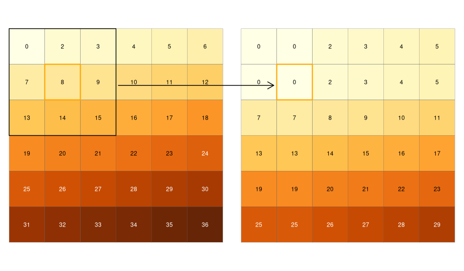

```{r}
library(tidyverse)
library(terra)
library(sf)
library(tmap)
```


### Let's read a raster image   

```{r}
myras <- terra::rast("../data/ts_2016.1007_1013.L4.LCHMP3.CIcyano.MAXIMUM_7day.tif")
```

plot it
```{r}
plot(myras)
```


### Basic properties

```{r}
terra::ext(myras)

terra::nlyr(myras)

terra::ncol(myras)

terra::nrow(myras)

terra::ncell(myras)


# to demonstrate rows * columns = cells
ncol(myras) * nrow(myras) == ncell(myras)

```

### QUESTION: what's the data structure of a raster file?


Get values by index
```{r}
myras[1]


myras[33961]

```

### Or by row, column
```{r}

#[row, column]  
myras[132, 164]
```

### Two questions:

1. How is "single indexing" different than row, column indexing?
2. For (row, column) indexing, what other information is useful/required to know what you're doing?


### Frequency of values 
```{r}

terra::freq(myras)
  

```
What's the output???


### Let's use it to make a quick histogram


```{r}
terra::freq(myras) %>%  
  ggplot(., aes(x = value, y = count)) +
  geom_bar(stat = "identity")
```

Was the plot useful? Why or why not?


### Let's try again
```{r}
terra::freq(myras) %>%
  dplyr::filter(value < 252) %>% 
  ggplot(., aes(x = value, y = count)) +
  geom_bar(stat = "identity")
```
Better?


Why not just use a histogram?

```{r}
terra::freq(myras) %>%
  dplyr::filter(value < 252) %>% 
  ggplot(., aes(x = value)) +
  geom_histogram()
```
Why NOT just use a histogram?

### Another way to "get" cell values
```{r}
myras %>% terra::values(.) %>%
  head(10)
```
Perhaps not the most useful for printing to the console, but does demonstrate how to access raw data values

## Raster aggregation

### What are some possible reasons we might want to change the resolution of a raster?

Let's break down the code
```{r}
terra::aggregate(myras, 2, fun = max)
```

What happened?


More obvious comparisons

```{r}
terra::aggregate(myras, 2, fun = max) %>% plot()
terra::aggregate(myras, 5, fun = max) %>% plot()
```

Interpret the results. How do they differ in spatial scale, generalization, etc.?


Different functions lead to different results

```{r}
raster::aggregate(myras, 5, fun = max) %>% plot()
raster::aggregate(myras, 5, fun = mean) %>% plot()
```

Again, how do they differ?


## Data conversions

Let's turn some cells into points
```{r}
myras %>% terra::as.points()
```
What's the data structure returned?


Maybe try plotting it?

```{r}
myras %>% terra::as.points() %>% plot()
```

What are we seeing?

We can also polygonize (if we'd like)

```{r}
poly1 <- terra::as.polygons(myras, dissolve = T)

tmap_mode("view")
tm_shape(poly1) + tm_polygons()
```

Zoom in. What do you see? What was the result?


Might be more obvious if we aggregate first

```{r}
myras %>% 
  terra::aggregate(., 3, fun = max) %>%
  terra::as.polygons(., dissolve = T) %>%
  tm_shape(.) + 
  tm_polygons()
```

Any questions?


## Map algebra

Map algebra (or cartographic modeling) divides raster operations into four subclasses (Tomlin 1990), with each working on one or several grids simultaneously:

1. Local or per-cell operations

2. Focal or neighborhood operations. Most often the output cell value is the result of a 3 x 3 input cell block

3. Zonal operations are similar to focal operations, but the surrounding pixel grid on which new values are computed can have irregular sizes and shapes

4. Global or per-raster operations; that means the output cell derives its value potentially from one or several entire rasters


### Local operations

- Local operations comprise all cell-by-cell operations in one or several layers

- Raster algebra is a classical use case of local operations


### Let's try an example

```{r}
plot(myras)
```

A simple local operation

```{r}
myras * 2 
```

How might you "check your work"? How would you know if this operation worked?

Ideas?


We could verify the range of values

```{r}
myras %>% values() %>% range(na.rm = T)

# What's different here?
(myras * 2) %>% values() %>% range(na.rm = T)
```

Other simple local operations:

```{r}
myras - 4
myras ** 2
log(myras)
```

...Essentially any algebraic operation works


### Reclassify

first, we need to setup our reclassification scheme

```{r}
rcl = matrix(c(0, 1, 0, 2, 249, 1, 250, 256, 0), ncol = 3, byrow = TRUE)
rcl
```
What does it look like? How do you expect it will work?

Next, apply it

```{r}
validdata = terra::classify(myras, rcl = rcl)
validdata
plot(validdata)
```
What do we have?

How might this (essentially binary) raster be useful?

Any ideas?

Let's multiply our "valid" raster with the original. What's your expected output?
```{r}
validRaster <- myras * validdata
plot(validRaster)
```
What was our result?


### We can "do algebra" using a function too!
```{r}
# NOAA transform for CHAMPLAIN data
# valid as of 2019-02-01 metadata
transform_champlain_olci <- function(x){
  
  10**(((3.0 / 250.0) * x) - 4.2)
}

myras.ci <- validRaster %>% transform_champlain_olci()
plot(myras.ci)
```

## Focal operations

- Focal operations take into account a central (focal) cell and  neighbors
- The neighborhood (also named kernel, filter, or moving window) can be any size/shape, but commonly a 3x3 grid
- operation applies aggregation function to all cells within the specified neighborhood
- function output is the new value for the the central cell, and moves on to the next central cell


*`(from https://geocompr.robinlovelace.net/spatial-operations.html#map-algebra)`*

### An example

Let's break down the code

How does it work conceptually?
```{r}
myras_focal = 
  terra::focal(myras.ci, 
               w = matrix(1, nrow = 3, ncol = 3), 
               fun = max)
plot(myras_focal)
```

Before we run it, how does this function differ from `aggregate` that we used earlier?

What does the new raster look like?

How might we know what actually changed?

### Change detection

```{r}
(myras_focal - myras.ci) %>% plot
```

What assumptions does the comparison make?

### Good practice is to verify same extent, projection, resolution, and origin

```{r}
terra::compare(myras_focal, myras.ci, "==")
```

## Global operations (are boring)

```{r}
myras.ci %>% terra::global(., "max", na.rm=TRUE)
myras.ci %>% terra::global(., "min", na.rm=TRUE)
myras.ci %>% terra::global(., "mean", na.rm=TRUE)
```

or
```{r}
myras.ci %>% terra::values() %>% mean(na.rm = T)
```

## Questions?


# Your task with the remaining time

Tell me how large the cyanobacteria bloom is in `myras`. I have shown you everything you need to know

1. Think through the problem CONCEPTUALLY
2. THEN once you have the process figured out, write the code
3. Compare your answer with your classmates'